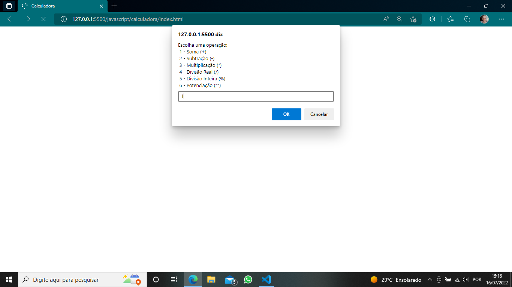

# CALCULATOR
 
Project created in dio bootcamp class.

  
  
  
  
  
  

> Project developed in the class "Basic Syntax in JavaScript". It is a calculator made only using JavaScript. It give the result of the sum, subtraction, multiplication, division, rest of division and potentiation.

## 🤝👩🏻 Collaborator

<table>
  <tr>
    <td align="center">
      <a href="#">
         
        
          <b>Isnaíra Souza</b>
        
      </a>
    </td>
    
</table>